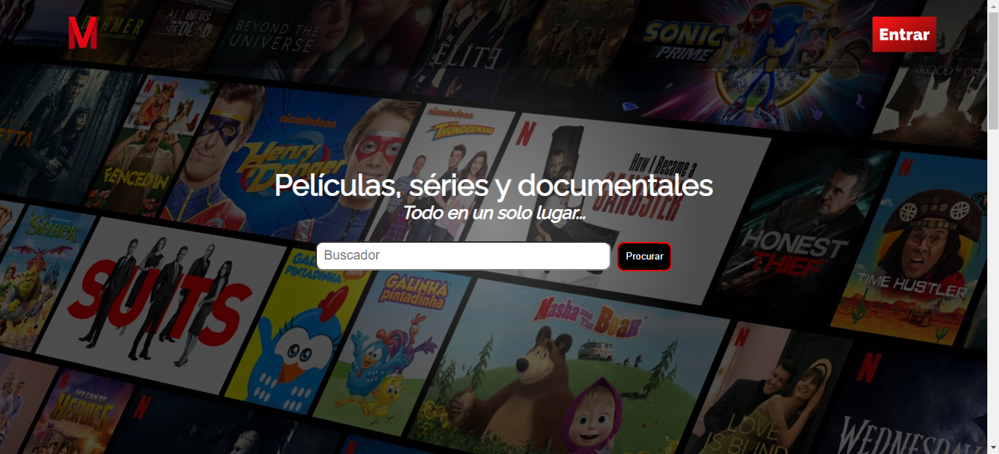

<h1>MundoFlix</h1>

This project was made to practice HTML and CSS.

In this project, JavaScript has a function to help CSS in the movies that are showing.

 
<h2>MundoFlix</h2>

 

<h2>📚Tecnologies:</h2>

<ul>
    <li>HTML</li>
    <li>CSS</li>
    <li>JavaScript</li>
    <li>Git and Github</li>
</ul>

<h2>💻Project:</h2>

This project was made with the intention of practicing these different technologies, it was one of the first projects I did and I updated it based on the third day of the Alura challenge, adding a brief poster with the names of the films being shown.

Visit the Project Online: <a href="https://ggabi40.github.io/MundoFlix">https://ggabi40.github.io/MundoFlix</a>

 

Desenvolved by GGabi40.
